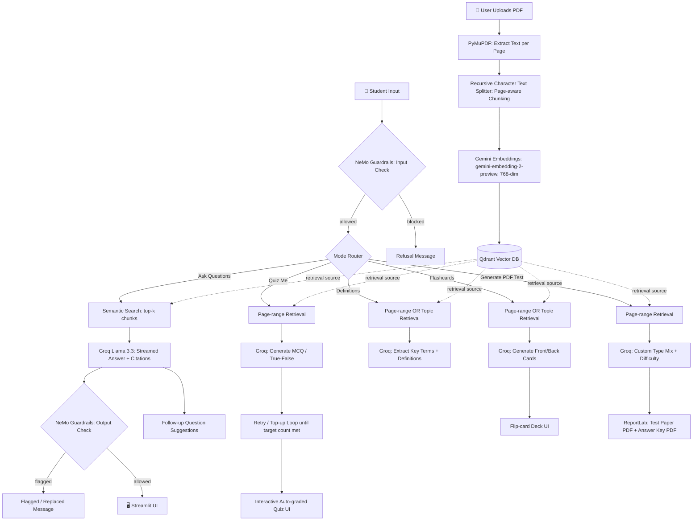

# 🪶 ContextIQ

**Turn any textbook PDF into an interactive study partner.**

ContextIQ is a Retrieval-Augmented Generation (RAG) study assistant. Upload a textbook, and it answers grounded questions with citations, quizzes you, extracts definitions, generates flip-card flashcards, and produces printable practice tests — all pulled directly from your own material, with a safety layer that blocks off-topic requests and jailbreak attempts before they ever reach the model.

Built for a hackathon submission. No user accounts required — upload and go.

---

## ✨ Features

### 💬 Ask Questions
- Grounded, streamed answers generated **only** from your uploaded textbook — no outside knowledge
- Inline page citations on every answer
- Expandable **source passage viewer** — see the exact retrieved text behind any answer, not just a page number
- **Multi-turn memory** — the last few exchanges are used as context, so natural follow-ups work
- **Follow-up question chips** — clickable, AI-suggested next questions after every answer

### 📝 Quiz Me (interactive, auto-graded)
- Multiple-choice and True/False only, since these are the only types that can be reliably auto-graded
- Choose page range and question count
- Retry/top-up generation loop — if the model under-delivers on a hard batch, it automatically asks for more instead of silently returning fewer questions than requested
- Instant scoring with per-question explanations after submission
- Attempt history tracked in the sidebar

### 📖 Definitions
- **By page range** — extracts every definable term/concept across a chapter
- **By topic** — ask for one specific term (e.g. "define osmosis") and get just that, not the whole chapter's glossary
- Relevance-score filtering so topic search doesn't wander into unrelated content

### 🗂️ Flashcards
- Flip-card deck covering **any** important info — facts, numbers, processes, relationships — not only formal definitions
- Generate **by page range** or **by topic**, your choice
- Prev / Flip / Next navigation with page-number attribution on the answer side

### 📄 Generate PDF Test
- Fully custom composition: choose **exactly which question types** to include (Multiple Choice, True/False, Short Answer, Long Answer) and how many
- Difficulty selector (Easy / Medium / Hard)
- Optional custom test title
- Produces **two separate PDFs**: a clean printable test paper and a separate answer key with explanations
- Auto-appends ruled answer lines for short/long answer questions (more lines for essay-style responses)

### 🛡️ Guardrails on every response
- Input checked for jailbreak attempts and clearly off-topic requests **before** any retrieval or generation happens
- Output checked for hallucination/safety flags after generation
- Powered by NVIDIA NeMo Guardrails, running on the same Groq model as the rest of the app

### ⚡ Other details
- Real token-by-token streaming for Q&A (not a fake typing animation)
- Cached retrieval layer — most UI interactions never hit the network, keeping the app fast
- One-click sample textbook for instant demoing, no upload required
- Dark, distraction-free UI with a built-in "How it works" page

---

## 🏗️ Architecture



**Ingestion pipeline** (top): a PDF is parsed page-by-page, split into overlapping chunks that retain page metadata, embedded with Gemini, and stored in Qdrant.

**Query pipeline** (bottom): every user action — whether a typed question or a button click — passes through a guardrails input check before touching retrieval, is routed to the appropriate mode, retrieves relevant chunks from Qdrant (semantic search for Q&A/topic lookups, or a direct page-range filter for chapter-scoped features), generates via Groq, and — for direct answers — passes through an output check before being shown.

---

## 🧰 Tech Stack

| Layer | Technology |
|---|---|
| UI | Streamlit |
| PDF Parsing | PyMuPDF |
| Chunking | LangChain `RecursiveCharacterTextSplitter` |
| Embeddings | Google Gemini (`gemini-embedding-2-preview`) |
| Vector Database | Qdrant Cloud |
| LLM | Groq (Llama 3.3 70B Versatile) |
| Guardrails | NVIDIA NeMo Guardrails |
| PDF Generation | ReportLab |

---

## 📁 Project Structure

```
ContextIQ/
├── app.py                     # Streamlit entrypoint — session state, mode routing, chat loop
├── ui.py                      # Styling + reusable rendering components
├── ui_extras.py                # Flashcard deck + follow-up chip components
├── config.py                   # Environment/settings loader
│
├── ingestion/
│   ├── loader.py               # PDF text extraction (PyMuPDF)
│   ├── chunker.py              # Page-aware recursive chunking
│   └── embedder.py             # Gemini embedding calls
│
├── vectorstore/
│   └── qdrantclient.py         # Upsert, semantic search, page-range search, list/delete
│
├── llm/
│   ├── groq_client.py          # Groq completion + streaming wrapper (with fallback key)
│   ├── qa.py                    # Grounded Q&A, multi-turn memory, follow-up questions
│   ├── quiz.py                  # Quiz generation with retry/top-up logic
│   ├── definitions.py           # Term extraction — by range or by topic
│   └── flashcards.py            # Flashcard generation — by range or by topic
│
├── guardrails/
│   ├── config.yml               # NeMo Guardrails model + rail configuration
│   └── guard.py                 # Input/output check wrappers around every generation path
│
├── reports/
│   └── pdf_generator.py         # Test paper + answer key PDF rendering (ReportLab)
│
├── scripts/
│   ├── create_indexes.py        # One-off Qdrant payload index setup
│   └── create_sample_pdf.py     # Generates the built-in sample textbook
│
├── assets/
│   └── sample_textbook.pdf      # One-click demo content
│
└── evals/                       # Retrieval precision + LLM-judged answer quality checks
    ├── dataset.py
    ├── judge.py
    └── run_eval.py
```

---

## 🚀 Getting Started

### Prerequisites
- Python 3.12
- A [Qdrant Cloud](https://cloud.qdrant.io) cluster (free tier is sufficient)
- API keys for [Groq](https://console.groq.com), [Google AI Studio](https://aistudio.google.com) (Gemini)

### Installation

```bash
git clone <your-repo-url>
cd contextiq
uv sync   # or: pip install -r requirements.txt
```

### Environment Variables

Create a `.env` file in the project root:

```env
GEMINI_API_KEY=your_gemini_api_key
QDRANT_CLUSTER_ENDPOINT=https://your-cluster.aws.cloud.qdrant.io
QDRANT_API_KEY=your_qdrant_api_key
GROQ_API_KEY=your_groq_api_key
GROQ_FALLBACK_API_KEY=your_backup_groq_api_key   # optional but recommended
```

### One-time setup

```bash
python scripts/create_indexes.py       # Creates Qdrant payload indexes (source, page)
python scripts/create_sample_pdf.py    # Generates the sample textbook for demo mode
```

### Run

```bash
streamlit run app.py
```

---

## 📖 Usage Guide

1. **Upload a textbook PDF** from the sidebar, or click **✨ Try a sample textbook** to demo instantly with zero setup.
2. Pick a mode from the top row of buttons: **Ask Questions**, **Quiz Me**, **Definitions**, **Flashcards**, or **Generate PDF Test**.
3. For chapter-scoped modes (Quiz, Definitions, Flashcards, PDF Test), use the page-range slider — or for Definitions/Flashcards, switch to topic mode and just type what you want to focus on.
4. Type naturally in the chat box at any time — ContextIQ recognizes phrases like *"quiz me,"* *"define X,"* *"flashcards on X,"* or *"generate a pdf test"* and will guide you to the right controls if a request needs a page range or count first.
5. Downloadable PDF tests appear in the **Practice tests** section of the sidebar as soon as they're generated.

---

## 🔒 Safety Notes

Every request — chat-typed or button-triggered — passes through a NeMo Guardrails input check before any retrieval or generation begins, blocking jailbreak attempts and clearly off-topic requests. Generated answers pass through a second output check afterward. Retrieval is always scoped to the uploaded document itself, so answers are grounded in what you gave the system, not the model's general training knowledge.

---

## 🗺️ Possible Future Improvements

- Auto-detected chapter/heading structure (currently page-range based)
- Persistent per-user accounts and cross-device history
- Hosted observability/tracing dashboard
- Multi-document cross-referencing in a single Q&A session

---
Thanks

*Built with Streamlit, Qdrant, Groq, Gemini, and NeMo Guardrails.*


